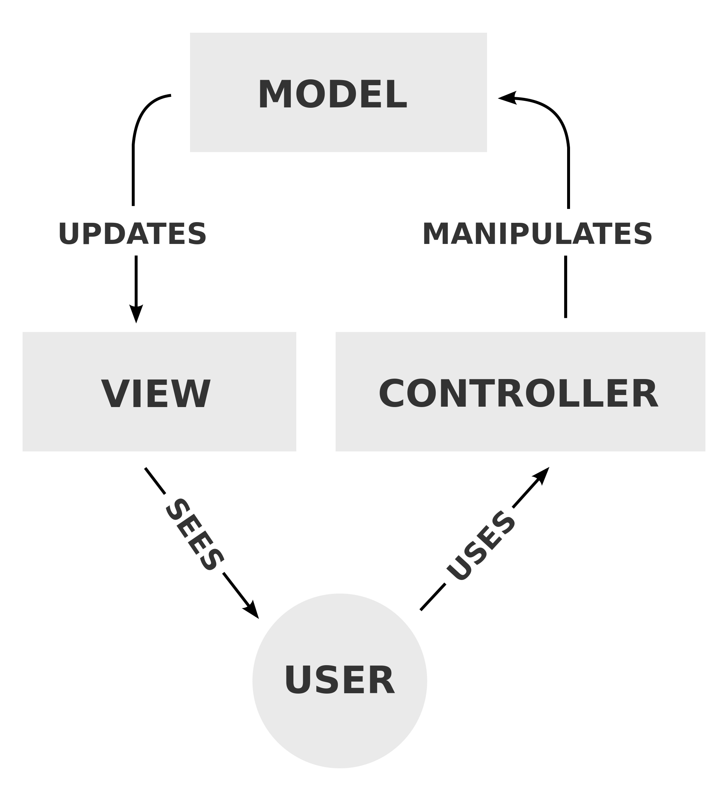

# How HTTP/MVC is like a plane

<!--9:55 5 minutes-->

## Objectives
*By the end of this class, students should be able to:*

- **Define** Model, View, and Controller
- **Describe** the steps of an HTTP Request and Response
- **Describe** the steps of building a full-stack web application


## Start with some vocabulary

- **Model**: The model directly manages the data, logic, and rules of the application.
- **View**: A view can be any output representation of information, such as a chart or a diagram.
- **Controller**: The controller accepts input and converts it to commands for the model or view.

## 1. The plane rolls out onto the tarmac.
An HTTP request is initiated when...
- ...the user clicks "Submit" on a form (a `POST` request) on your website
- ...the user clicks "Submit" on Postman
- ...the user enters a URL in their web browser and hits Return (a `GET` request)

<!--10:00 10 minutes -->

## 2. The plane is loaded up with cargo and prepped to fly to another airport.
The web browser packages the information the user submitted in the form -- the **parameters** -- and gets it ready to be sent to your server.

Let's say the form looks like this:
```
<form method="post" action="/nerds">
  <input type="text" name="name" value="Zeb" />
  <input type="text" name="title" value="Professor of Fibonaccization" />
  <button type="submit">Take off!</button>
</form>
```

The request will be sent to the URL `/nerds`, which was taken from the `action` attribute of the `form`.

### 2.a The cargo is strapped to the roof of the plane.

If the `method` is `GET`, the web browser turns the parameters into a querystring, attached to the end of the request's destination URL:
```
/nerds?name=Zeb&title=Professor%20of%20Fibonaccization
```

### 2.b The cargo is placed in the plane's cargo hold.

If the `method` is `POST`, the web browser turns the parameters into a key-value store (like a JS object). In this case, something like:
```
{
  name: "Zeb",
  title: "Professor of Fibonaccization"
}
```

<!--10:10 5 minutes -->

## 3. The plane takes off!
*What actually happens:* The HTTP request is sent from the user's browser to your server.

If the `method` is `GET`, The web browser sends a request to  `/nerds?name=Zeb&title=Professor%20of%20Fibonaccization`.

If the `method` is `POST`, the web browser sends a request to `/nerds`, with the parameters sent behind-the-scenes in the request's "body", invisible to the user.

<!--10:15 10 minutes -->

## 4. The plane arrives at the destination airport, and is routed to land at a specific runway by the Air Traffic Control tower.

*What actually happens:* The `server.js` file on your server receives the HTTP request and directs it to one of the "routes" specified in `server.js` or a `routes.js` file `require`d in `server.js`.

If the request is `GET` it'll be sent to the `get("/nerds", ...` route.

If the request is `POST` it'll be sent to the `post("/nerds", ...` route.

## 5. The cargo is unloaded from the plane.
*What actually happens:* The HTTP request is parsed. The server takes the parameters from either the URL (`GET`) or the body (`POST`) and stores it in the `request` (or `req`) object.

<!--10:25 10 minutes -->

## 6. The cargo is processed.
*What actually happens:* The server runs the (callback) function that's inside the route. That is our **controller**.  Generally, this does something *to* or *with* the information contained in the `request`.

For example:

```
app.post("/nerds", function(req,res) {
  Nerd.create({name: req.body.name, title: req.body.title});
});
```
This will add a document to the `nerds` collection that has the value `Zeb` for the `name` key, and `Professor of Fibonaccization` for the `title` key.

### 6.a. New cargo is retrieved from the warehouse, according to specifications

The "warehouse" is the database. There are a bunch of different sections (collections) in this warehouse, and the specifications for storing, accessing, changing, and deleting cargo (documents) in each section are called **models**.

<!--10:44 -->

<!--10:35 10 minutes -->

## 7. The processed cargo is (maybe) sent to a packaging plant.
*What actually happens:* If the route indicates that an `.ejs` template should be used, the information that was manipulated with the **controller** is sent to the `.ejs` template.

```
app.post('/nerds', function(req, res) { //and look at that controller
	Nerd.create({name: req.body.name, title: req.body.title}, function(error, nerd) {
		res.render('nerd_show', {nerd: nerd});
	});
});
```

The information is then inserted into the `.ejs`, replacing the relevant `<% %>` or `<%= %>` tags.

For example:

```
<h1>Introducing <%= nerd.name %>, also known as <%= nerd.title %></h1>
```

This becomes:

```
<h1>Introducing Zeb, also known as Professor of Fibonaccization</h1>
```

If you view the source code of a page in your Node app, you will see **no EJS tags** -- just HTML.  This is our **view**.

<!--10:45 5 minutes -->

## 8. The packaged cargo is sent back to the first airport.
*What actually happens:* A server sends something back, a string of information, in response to every HTTP request.

When you type a URL in your browser's address bar and hit Return, your browser makes a `GET` request to another server. The string of information the server sends back is HTML/CSS/Javascript, which your browser reads and turns into a webpage.

When you make a `POST` request, the server might respond with a string that tells your web browser to redirect you to another page. It might also respond with the HTML/CSS/Javascript to make a full webpage. It might also just return a short string saying the request was successful. That's up to the developer, and depends on what they want the app to do.

In this case, the HTML of the rendered nerd page is the string that will be sent back.

<!--10:50 5 minutes -->

## Putting it all together



<!--10:55 5 minutes -->

<!-- Wrap-up with catch phrase on model, view, and controller -->

<!--11:12 -->
